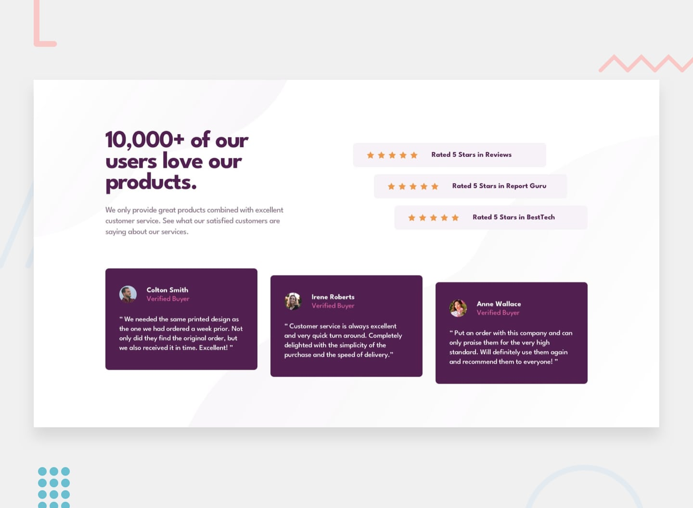

# Frontend Mentor - Social proof section solution

This is a solution to the [Social proof section challenge on Frontend Mentor](https://www.frontendmentor.io/challenges/social-proof-section-6e0qTv_bA).

## Table of contents

- [Overview](#overview)
  - [The challenge](#the-challenge)
  - [Links](#links)
  - [Screenshot](#screenshot)
- [My process](#my-process)
  - [Built with](#built-with)
- [Author](#author)

## Overview

### The challenge

Users should be able to:

- View the optimal layout for the section depending on their device's screen size

### Screenshot

- [Mobile](./images/screenshots/mobile.png)
- [Tablet](./images/screenshots/tablet.png)
- [Desktop](./images/screenshots/desktop.png)

### Links

- Solution URL: [URL here](https://www.frontendmentor.io/solutions/social-proof-section-GnCS-qOIeu)
- Live Site URL: [URL here](https://femc-social-proof-section.netlify.app/)

## My process

### Built with

- Semantic HTML5 markup
- Flexbox
- Animation
- BEM
- Mobile-first workflow

## Author

- Frontend Mentor - [@xyzeez](https://www.frontendmentor.io/profile/xyzeez)
- Twitter - [@abdusamii_](https://twitter.com/abdusamii_)
